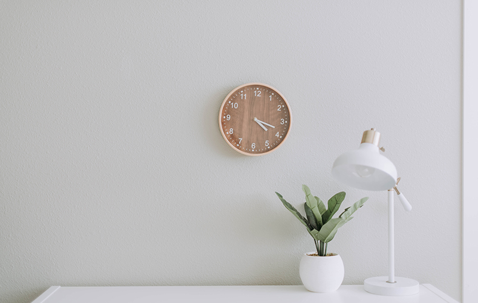

# Living the Simple Life - Blog App 🌱✨

<div align="center">

[](https://reactjs.org/) [](https://developer.mozilla.org/en-US/docs/Web/CSS) [](https://developer.mozilla.org/) [](https://reactrouter.com/)

</div>

## 📖 Project Description

**Living the Simple Life** is a modern, fully responsive blog application dedicated to minimalism and mindful living. It features a premium, clean design system, smooth micro-animations, and a highly responsive user interface built from the ground up using **CSS Modules**.

Beyond its beautiful and calming design, the application is built with a focus on scalable component architecture and dynamic routing. Developed using modern web technologies:

- **React** (Component-Based UI Architecture)
- **Vanilla CSS / CSS Modules** (Custom Premium Styling without external frameworks)
- **JavaScript** (Application Logic & Dynamic Data)
- **React Router v7** (Fast, Client-Side Navigation)

## 📸 Screenshots 🖼️

<div align="center">
  <table>
    <tr>
      <th align="center">Screen</th>
      <th align="center">Desktop View</th>
      <th align="center">Mobile View</th>
    </tr>
    <tr>
      <td align="center"><strong>Home Feed</strong></td>
      <td align="center"><em></em></td>
      <td align="center"><em></em></td>
    </tr>
    <tr>
      <td align="center"><strong>Dynamic Post</strong></td>
      <td align="center"><em></em></td>
      <td align="center"><em></em></td>
    </tr>
  </table>
  <p><em>*Note: Replace image paths with actual screenshots of your app later.</em></p>
</div>

## 📖 Table of Contents

- [🛠️ Technologies & Styles Used 🎨](#️-technologies--styles-used-)
- [✨ Core Features](#-core-features)
- [🗺️ Application Pages](#️-application-pages)
- [📂 Folder Structure](#-folder-structure)
- [🚀 Installation Instructions](#-installation-instructions)
- [💻 How to run the development server](#-how-to-run-the-development-server)
- [🎨 Design Decisions](#-design-decisions)
- [🤝 How to Contribute](#-how-to-contribute)
- [✍️ Author](#️-author)

---

## 🛠️ Technologies & Styles Used 🎨

- **Frontend Core:** React, React Router 7
- **Styling:** CSS Modules (`.module.css`) and Global CSS variables
- **Data:** JavaScript Object Arrays (Mock Database)
- **Code Quality:** Modern `.jsx` extensions and structured component trees

---

## ✨ Core Features

- **Dynamic Routing:** Seamlessly navigate between blog posts using `react-router-dom` URL parameters (`/post/:id`).
- **Mock Database:** A local `posts.js` file simulating an API, providing distinct titles, images, and content for each article.
- **Premium Design System:** A handcrafted UI featuring beautiful typography, harmonious colors, and subtle hover animations.
- **Fully Responsive:** Flawless reading experience across desktop, tablet, and mobile devices using CSS Grid and Flexbox.
- **Component-Driven:** Highly modular React components (e.g., `ArticleFeatured`, `ArticleRecent`, `Sidebar`).

## 🗺️ Application Pages

The blog is split into several interactive pages:

- **Home (`/`)**: The main landing page featuring the most important article, recent posts, and a dynamic sidebar.
- **About Me (`/about-me`)**: A beautifully styled introductory page.
- **Recent Posts (`/recent-posts`)**: A dedicated page displaying a complete list of recent articles.
- **Dynamic Post (`/post/:id`)**: A fully dynamic single-post page displaying the full content, author info, and specific images based on the requested article ID.

---

## 📂 Folder Structure

The application strictly adheres to a scalable, modular architecture:

```text
src/
├── components/      # Reusable UI components
│   ├── Grid/        # Layout components (Main, Sidebar)
│   ├── Nav/         # Navigation components
│   └── Footer/      # Footer components
├── data/            # Mock database
│   └── posts.js     # Array of blog posts
├── pages/           # Route-level components representing full views
│   ├── Home.jsx
│   ├── AboutMe.jsx
│   ├── RecentPosts.jsx
│   └── Post.jsx
├── App.jsx          # Main application routing and layout wrapper
└── index.css        # Global CSS variables and base responsive styles
```

---

## 🚀 Installation Instructions

1. Clone the repository:

   ```bash
   git clone https://github.com/waleedtarbosh/Living-the-simple-life-React.git
   cd Living-the-simple-life-React
   ```

2. Install dependencies:

   ```bash
   npm install
   ```

---

## 💻 How to run the development server

Start the local development server by running:

```bash
npm start
```

Then, open [http://localhost:3000](http://localhost:3000) in your browser.

---

## 🎨 Design Decisions

The visual identity of this application revolves around a **Minimalist Premium Theme**.
* **CSS Modules:** Selected to avoid class name collisions while allowing custom, highly maintainable styling without relying on heavy external frameworks.
* **Color Palette:** A highly contrasted light surface paired with soft muted accents creates a calming "simple life" aesthetic that makes long-form reading comfortable.
* **Responsive Layout:** Leveraging standard CSS Flexbox and media queries, the UI is decoupled into modular components, ensuring a highly responsive and seamless single-page application experience across all devices.

---

## 🚀 Future Improvements

While the application fulfills all core requirements, future iterations could include:
* **API Integration:** Replacing `posts.js` with a real backend headless CMS (like Strapi or Sanity).
* **Dark Mode:** Adding a toggle for a dark theme reading experience.
* **Comments Section:** Implementing a functional comments area at the bottom of dynamic posts.

---

## 🤝 How to Contribute

Contributions, issues, and feature requests are welcome!
Feel free to check the [issues page](https://github.com/waleedtarbosh/Living-the-simple-life-React/issues).

---

## ✍️ Author

**Waleed Tarbosh** - _Front-End Developer_

- GitHub: [@waleedtarbosh](https://github.com/waleedtarbosh)

---

## 📄 License

This project is licensed under the MIT License - see the [LICENSE](LICENSE) file for details.
⬆️ [Back to Top](#living-the-simple-life---blog-app-)
